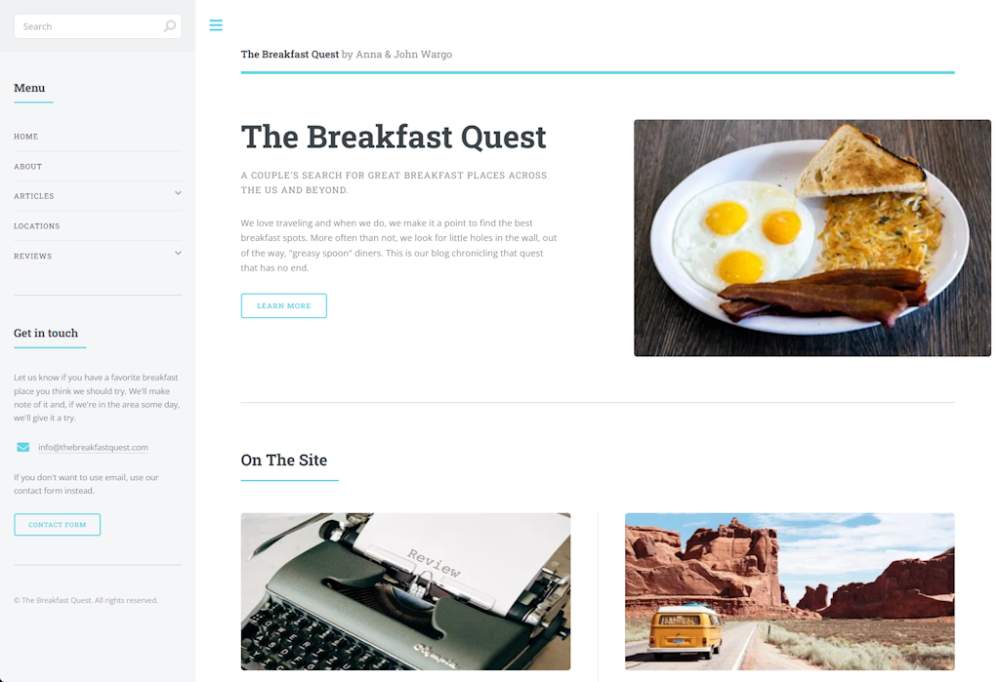

[](https://app.netlify.com/projects/breakfastquest/deploys)

> [!WARNING]
> Work in progress; this site may be publicly available, but it's not ready for prime time yet.

Netlify project: [https://breakfastquest.netlify.app/](https://breakfastquest.netlify.app/).
Pixelarity Template: [Editorial](https://pixelarity.com/editorial)

## Map

With Google Maps, you can feed it a data file with latitude and longitude values as well as a location name, pictures, etc.
Recommend adding long and lat values to post front matter and generating the file during the build process. 
Map page loads the data file from the server and passes it to the Google Maps API.

**Generating Latitude & Longitude**

Use the `geocoder` command in the terminal to calculate latitude and longitude from an address

``` shell
geocoder "<restaurant_address>"
```

**Home Page Image Dimensions**

+ 416 x 256

## Tasks

- [ ] Higher resolution breakfast plate image
- [ ] Home Page content
  [ ] About page content
- [ ] Reviews 
  - [x] By Restaurant name
  - [x] By Visit date
  - [ ] By State (collapsed) or perhaps city?
- [ ] Post page, display rating as stars
- [ ] Application icon
- [ ] Setup info@ email address
- [ ] Contact form
  - [ ] Use third party service (?)
  - [ ] Contact form **Reset** button
  - [ ] Contact form **Send** button
- [ ] Newsletter
  - [ ] Newsletter sign-up in sidebar
  - [ ] Delete About menu item
- [x] Google Analytics
- [x] Algolia index
- [x] Search
- [x] Review Page
  - [x] Link address to Google Maps
- [ ] 
- [ ] 

## Post Launch

- [ ] Home Page: Top 10 popular posts listing
- [ ] Most popular articles page
- [ ] Locations page: Make PWA and cache locations data locally


## Scott Tasks

- [ ] Newsletter form
  - [ ] Narrow input fields
  - [ ] Suck up space above the form
- [ ] Search page
  - [ ] Put button at the end of the input field
  - [ ] Shorten input field
- [ ] 
- [ ] 
- [ ] 
- [ ] 
- [ ] 
- [ ] 
- [ ] 
- [ ] 

## Thinking List

- [ ] Calendar view? Could be fun.
- [ ] Menus
- [ ] News
- [ ] Recipes?  Perhaps from the restaurants?
- [ ] 
- [ ] 
- [ ] 
- [ ] 
- [ ] 